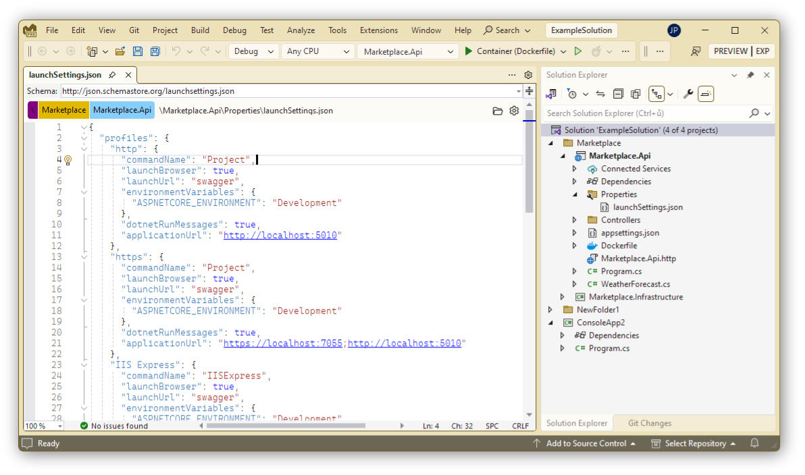

# Editor Bar

## Introduction
Editor Bar is a Visual Studio extension designed to enhance your coding experience. It displays the path of the current file along with the name of the current project, making it easier to manage files with the same name in different projects within a solution.

## Features
- Displays file path and project name in the editor bar
- Customizable display options
- Quickly copy full or relative path to clipboard
- Open file location in Windows Explorer

## Screenshots

## Licence
Apache 2.0

## Author 
[Jiøí Polášek](https://jiripolasek.com)