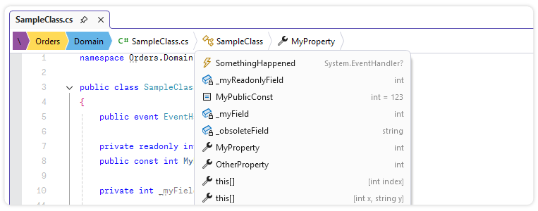
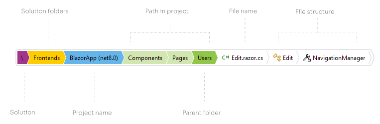
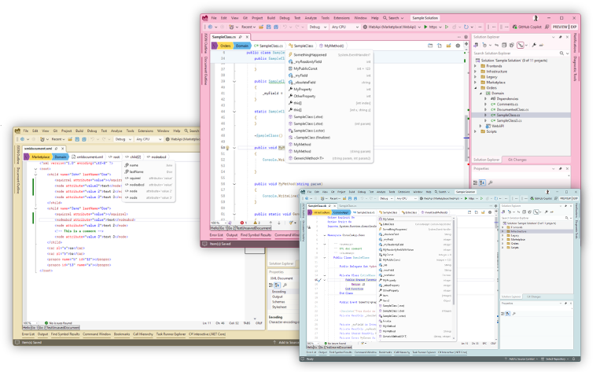
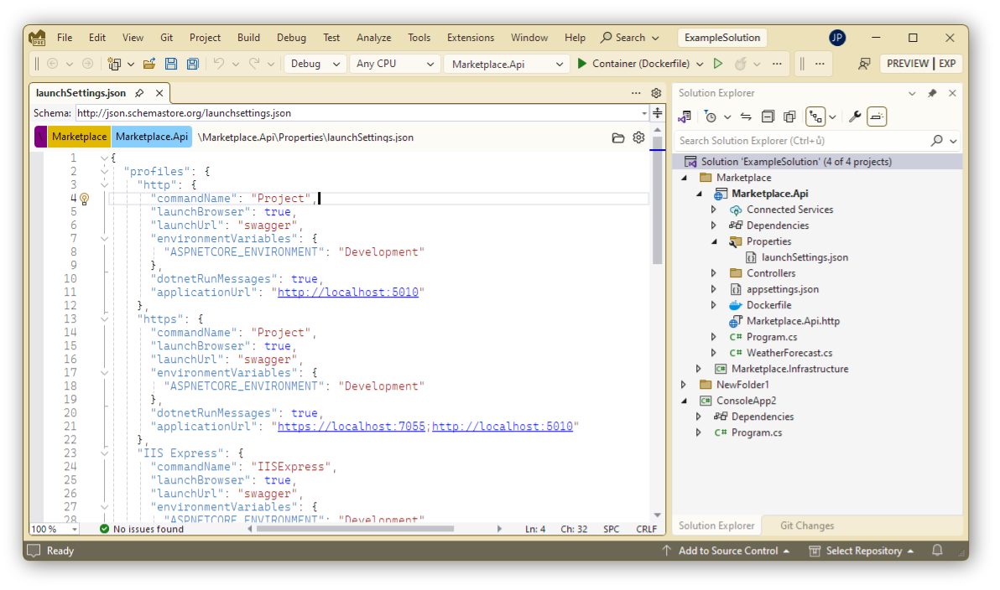
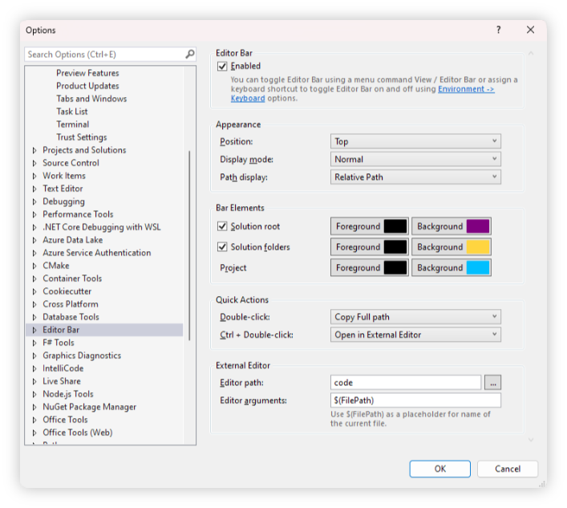

	

<h1>Editor Bar for Visual Studio</h1>

## Introduction

**Editor Bar** is a Visual Studio 2022 and Visual Studio 2026 extension designed to simplify your coding workflow by providing clear and intuitive breadcrumbs for effortless navigation.

The extension displays the current file path and project name, enabling quick identification of files with similar or identical names (like `launchSettings.json` in every project or `/Pages/Users/Edit.razor` vs `/Pages/Roles/Edit.razor`).

In supported files, it also displays breadcrumbs for symbols or nodes up to the cursor position. This works for C# and VB.NET files, as well as nodes in XML documents. Recent updates added support for C# 14 extension blocks, richer breadcrumb context menus and child popups, Open in Terminal, and expanded appearance customization. Additional formats will be supported in future updates.

## Features

- **Breadcrumb Navigation** 
  - Highlights key elements of the file location and for supported files a breadcrumb trail of the current file node or symbol up to the cursor position:
      - Solution and solution folders
      - Project
      - Project folders
      - Parent folder name
      - File name
      - File structure (types, members, nodes, ...)
        - C# (including C# 14)
        - VB.NET
        - XML

- **Quick Actions**
   - Copy full or relative file path to Clipboard.
   - Open the current file in a custom or default external editor.
   - Open file location in Windows Explorer.
   - Open the current location in Terminal.
   - Locate the item in Solution Explorer.
   - Switch active target framework for IntelliSense (in multi-targeting projects).
   - Use context menus and child popups directly from breadcrumbs, including solution folders and non-solution roots.

- **Member search**
   - Quickly find and navigate to any member in the current file using a searchable dropdown.
   - Supports glob-style wildcard filtering with `*` and `?`.
   - Switch filtered member tree results between hierarchical tree and flat list views, with a configurable default mode.
   - Optionally show or hide the filter box in the member list.
   - Match the filter box background to the active Visual Studio theme.

- **Customizable Options**
   - Select what to display in the breadcrumbs bar.
   - Adjust size, colors, and quick-actions to suit your preferences.
   - Control toolbar button visibility.
   - Configure separate light and dark color settings.
   - Keep Editor Bar settings compatible with Visual Studio import/export.

- **Seamless Control**:
   - Toggle the Editor Bar on and off using a toolbar icon or a keyboard shortcut.
   - Stay out of tool windows where the bar does not belong, including ReSharper windows.

- **Additional Features:**
   - See [complete changelog](CHANGELOG.md) for more details.

## Screenshots

## Licence

Apache 2.0

## Author

[Jiří Polášek](https://jiripolasek.com)
