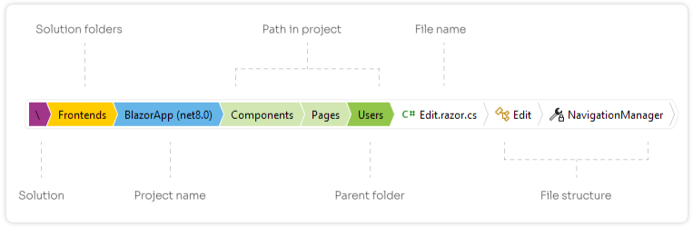

	

<h1>Editor Bar for Visual Studio 2022</h1>

## Introduction

**Editor Bar** is a Visual Studio 2022 extension crafted to streamline your coding workflow. It provides an intuitive breadcrumbs bar displaying the file path and current project name, ensuring effortless navigation and management of files, particularly those with identical names across different projects or folders within a solution.

This functionality addresses common challenges when editing files with similar names, such as `launchSettings.json` across multiple projects or within the same project (e.g., `/Pages/Users/Edit.razor`, `/Pages/Roles/Edit.razor`). The breadcrumbs bar provides clear context, reducing confusion and improving navigation efficiency.

## Features

- **Breadcrumb Navigation:** Highlights key elements of the file location and current caret position in the file:
  - Solution folders
  - Project name
  - Project folders
  - Parent folder name
  - File name
  - File structure (types, members, nodes, ...)

- **Customizable Options:**
  - Select what to display in the breadcrumbs bar.
  - Adjust size, colors, and quick-actions to suit your preferences.

- **Quick Access Actions:**
  - Copy full or relative file path to clipboard.
  - Open file location in Windows Explorer or an external editor.

- **Seamless Control**:
  - Toggle the Editor Bar on and off using a toolbar icon or keyboard shortcut.

- **Additional Features:**
  - See [complete changelog](CHANGELOG.md) for more details.

## Screenshots

## Licence

Apache 2.0

## Author

[Jiří Polášek](https://jiripolasek.com)
